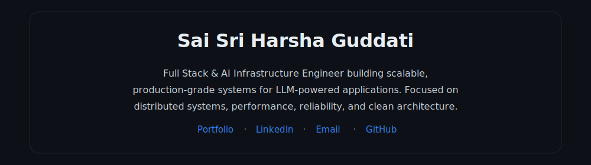
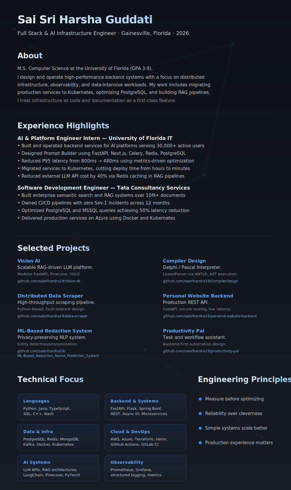
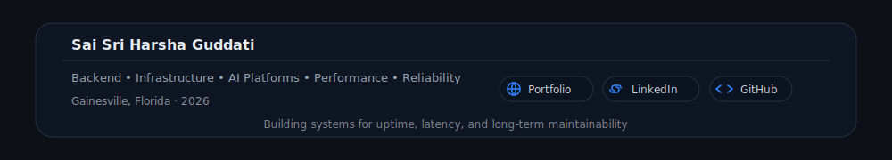

 

<a href="https://saisriharsha.me">Portfolio</a> ·
<a href="https://www.linkedin.com/in/sai-sri-harsha-guddati">LinkedIn</a> ·
<a href="mailto:saisriharshaguddati1@gmail.com">Email</a> ·
<a href="https://github.com/saisriharsha19">GitHub</a>

---

---

## Technical Focus

**Languages**  
Python, Java, TypeScript, SQL, C++, Bash

**Backend & Systems**  
FastAPI, Flask, Spring Boot, REST, Async IO, Microservices

**Data & Infra**  
PostgreSQL, Redis, MongoDB, Kafka, Docker, Kubernetes

**Cloud & DevOps**  
AWS, Azure, Terraform, Helm, GitHub Actions, GitLab CI

**AI Systems**  
LLM APIs, RAG architectures, LangChain, Pinecone, PyTorch

**Observability**  
Prometheus, Grafana, structured logging, metrics

---

## Engineering Principles

- Measure before optimizing  
- Reliability over cleverness  
- Simple systems scale better  
- Production experience matters  

---

If you are building large-scale systems, AI platforms, or developer infrastructure, I am always open to meaningful conversations.

